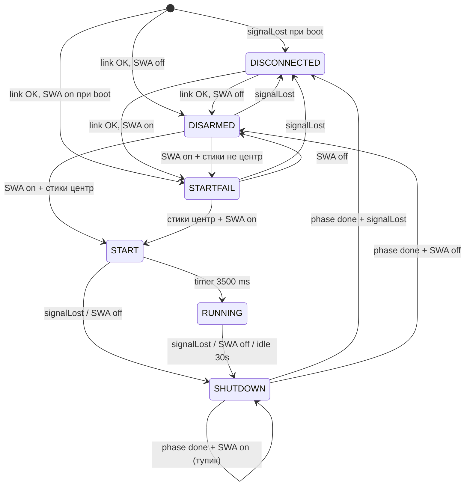

# Аудит проекта «Tanki» — v1.0.1

| | |
|---|---|
| **Дата аудита** | 26 июля 2026 |
| **Версия отчёта** | v1.0.1 (повторный полный аудит) |
| **Предыдущий аудит** | [`AUDIT_REPORT.md`](AUDIT_REPORT.md) от 25.07.2026 |
| **Версия прошивки** | **v1.0.1** (Production Ready, по заявлению автора) |
| **Последний коммит** | `976e4ec` — docs(release): финальный релиз v1.0.1 |
| **Незакоммиченные файлы** | 3 новых документа (см. §10) |

---

## Содержание

1. [Резюме и динамика с прошлого аудита](#1-резюме-и-динамика-с-прошлого-аудита)
2. [Обзор проекта](#2-обзор-проекта)
3. [Архитектура прошивки v1.0.1](#3-архитектура-прошивки-v101)
4. [Соответствие документации и кода](#4-соответствие-документации-и-кода)
5. [Соответствие дорожной карте](#5-соответствие-дорожной-карте)
6. [Критические и высокоприоритетные проблемы](#6-критические-и-высокоприоритетные-проблемы)
7. [Средний приоритет](#7-средний-приоритет)
8. [Низкий приоритет / качество кода](#8-низкий-приоритет--качество-кода)
9. [Безопасность (Safety)](#9-безопасность-safety)
10. [Документация](#10-документация)
11. [Подсистемы: детальный разбор](#11-подсистемы-детальный-разбор)
12. [Сводная таблица рисков](#12-сводная-таблица-рисков)
13. [Общая оценка](#13-общая-оценка)
14. [Рекомендуемый порядок работ](#14-рекомендуемый-порядок-работ)

---

## 1. Резюме и динамика с прошлого аудита

Между аудитами (25.07 → 26.07.2026) проект прошёл **существенную эволюцию**: от простого 4-состоянийного FSM (v1.0) до полноценной 6-состоянийной машины состояний с плавным торможением, thread-safe аудио и формальной документацией.

### Что исправлено / реализовано

| ID (старый аудит) | Проблема | Статус v1.0.1 |
|-------------------|----------|:-------------:|
| R1 | Беспорядочное вращение гусениц при Failsafe OFF | ✅ **Исправлено** (`v0.21`): проверка `signalLost` **до** `updateMixer()` в `STATE_RUNNING` |
| — | Межъядерный Deadlock I2S | ✅ **Исправлено** (`v0.11`): флаги `targetAudioMode` / `targetSampleRate`, I2S только на Core 0 |
| — | Нет `stop.wav` / режима глушения | ✅ **Реализовано**: `AUDIO_MODE_STOP`, `STATE_SHUTDOWN` |
| — | Нет плавного торможения | ✅ **Реализовано**: 2-секундный ramp в `STATE_SHUTDOWN` |
| — | Сброс громкости при Failsafe | ✅ **Исправлено** (`v1.0.1`): кэш `lastValidVrA` |
| — | Зависание UART | ✅ **Mitigated**: `emergencyCounter` + `Serial2.flush()` в `readIBus()` |
| R7 | Нет README / документации | ✅ **Частично**: добавлена полная спецификация v1.0.1 + FSM-спецификация |
| R3 | Сервопривод не реализован | ❌ **Без изменений** |
| R2 | WAV-файлы не в репозитории | ❌ **Без изменений** |
| R4 | Нет WDT | ❌ **Без изменений** |
| R5 | Дублирование deadband | ❌ **Без изменений** |
| R6 | Нет unit-тестов | ❌ **Без изменений** |

### Ключевые коммиты после предыдущего аудита

```
976e4ec  v1.0.1  docs + fix громкости при дисконнекте
1218160  v0.21   fix failsafe OFF — неконтролируемое вращение гусениц
f2a34a4  v0.20   новая FSM + плавное торможение
93c3d7b  v0.11   рефакторинг I2S, thread-safe аудио, stop.wav
```

---

## 2. Обзор проекта

| Компонент | Содержимое |
|-----------|------------|
| **Прошивка** | ESP32 (LOLIN32 Lite), PlatformIO, Arduino + FreeRTOS |
| **Исходники** | 11 файлов, **~911 строк** в `Firmware/Tanki/src/` |
| **Документация** | 6 markdown/txt документов + электросхемы |
| **Тесты** | Отсутствуют |
| **Аудио-ассеты** | `start.wav`, `idle.wav`, `stop.wav` — **ожидаются в LittleFS, в репозитории отсутствуют** |
| **Статус релиза** | Production Ready (заявлен в коммите `976e4ec` и спецификации) |

### Структура исходников

```
Firmware/Tanki/src/
├── main.cpp            (290 строк) — FSM v1.0.1, failsafe, телеметрия
├── ibus_parser.h/cpp   (126 строк) — i-BUS + emergencyCounter
├── mixer.h/cpp         (51 строк)  — дифференциальный микшер
├── motor_control.h/cpp (95 строк)  — LEDC, гусеницы BTS7960
├── turret_control.h/cpp(72 строк)  — LEDC, башня DRV8833
└── audio_system.h/cpp  (277 строк) — I2S + FreeRTOS Core 0
```

### Структура репозитория

```
e:\Tanki\
├── AUDIT_REPORT.md
├── AUDIT_REPORT_v1.0.1.md              ← этот файл
├── Дорожная карта проекта «Tanki» - 1.md
├── Полная спецификация ... (v1.0.1).md  ← NEW (untracked)
├── Спецификация FSM и План реализации.md ← NEW (untracked)
├── Танки State Machine (draft).md       ← NEW (untracked)
├── Electrical\                          — pinout, SVG/MMD схемы
├── Firmware\Tanki\                      — прошивка PlatformIO
└── Tanki.code-workspace
```

---

## 3. Архитектура прошивки v1.0.1

### 3.1. Распределение по ядрам

```
┌─────────────────────────────────────────────────────────────┐
│  Core 1 — loop()                                            │
│  ├── readIBus()           UART Serial2, GPIO 34             │
│  ├── FSM (6 состояний)    main.cpp                          │
│  ├── updateMixer()        mixer.cpp → motor_control         │
│  ├── setTurretSpeed()     turret_control                    │
│  ├── setAudioMode()       → targetAudioMode (volatile)      │
│  ├── setAudioVolume()     → currentVolume (volatile)        │
│  └── updateEngineSound()  → targetSampleRate (volatile)     │
├─────────────────────────────────────────────────────────────┤
│  Core 0 — audioTask (FreeRTOS, priority 1, stack 4096)       │
│  ├── i2s_set_sample_rates()  — только здесь                 │
│  ├── LittleFS WAV playback   — start / idle / stop          │
│  ├── Программная сирена       — 600/400 Hz                  │
│  └── Авто-склейка start→idle, stop→mute                     │
└─────────────────────────────────────────────────────────────┘
```

### 3.2. Конечный автомат (6 состояний)



| Состояние | Моторы | Аудио | Длительность / особенности |
|-----------|--------|-------|---------------------------|
| `DISCONNECTED` | 0 | SIREN 15 с → MUTE | При обрыве связи |
| `DISARMED` | 0 | MUTE | Безопасное ожидание |
| `STARTFAIL` | 0 | SIREN (без лимита) | Ошибка оператора |
| `START` | 0 | START → idle (Core 0) | 3.5 с, ввод заблокирован |
| `RUNNING` | микшер | ENGINE + pitch | Авто-stop через 30 с простоя |
| `SHUTDOWN` | ramp 2 с → hold 3 с | STOP → MUTE | Плавное торможение |

### 3.3. Сильные стороны архитектуры

- **Модульность** — чёткое разделение парсера, микшера, моторов, башни, аудио
- **Thread-safe аудио** — Core 1 только выставляет флаги, Core 0 управляет I2S
- **Защита от Failsafe OFF** — `break` в `STATE_RUNNING` до обработки мусорных данных приёмника
- **Smart Braking** — линейная интерполяция стиков к 1500 µs за 2 секунды
- **Кэш громкости** — `lastValidVrA` сохраняет VRA при стабильной связи
- **Телеметрия** — секундный `[DIAG]`-лог + логирование переходов FSM
- **Doxygen-комментарии** — все ключевые файлы задокументированы inline

---

## 4. Соответствие документации и кода

### 4.1. Согласованность FSM-спецификации и `main.cpp`

| Требование (Спецификация FSM) | Код | Статус |
|-------------------------------|-----|:------:|
| 6 состояний SystemState | enum из 6 значений | ✅ |
| Старт: DISCONNECTED / DISARMED / STARTFAIL | `isFirstLoop` блок | ✅ |
| DISCONNECTED: сирена 15 с | `SIREN_MAX_DURATION_MS = 15000` | ✅ |
| STARTFAIL: непрерывная сирена | `AUDIO_MODE_SIREN` без таймера | ✅ |
| START: блокировка + start.wav | моторы 0, `AUDIO_MODE_START` | ✅ |
| RUNNING: auto-shutdown 30 с | `AUTO_SHUTDOWN_MS = 30000` | ✅ |
| SHUTDOWN: 2 с ramp + 3 с hold | фазы 2000 / 5000 ms | ✅ |
| SHUTDOWN тупик при SWA on | комментарий + отсутствие перехода | ✅ |
| START → RUNNING по таймеру 3.5 с | `START_DURATION_MS = 3500` | ✅ |

**Вывод:** логика FSM в коде **полностью соответствует** утверждённой спецификации.

### 4.2. Расхождения документации и кода

| # | Документ | Проблема | Severity |
|---|----------|----------|----------|
| D1 | Полная спецификация v1.0.1, §1.2 | GPIO 14 указан как «Сервопривод поворота башни». В коде башня — **GPIO 32/33** (`turret_control.cpp`), GPIO 14 — заготовка под **орудие** (`PIN_SERVO`) | 🟡 Medium |
| D2 | Полная спецификация v1.0.1, §1.2 | Таблица pinout **не содержит** пины гусениц 16/17/19/23 (есть в `Electrical/Pinout_ESP32.txt` и коде) | 🟡 Medium |
| D3 | Полная спецификация v1.0.1 | Статус «Production Ready», но **нет инструкции** `pio run -t uploadfs` и нет WAV в репо | 🔴 High |
| D4 | Спецификация FSM, §1.2 | «Громкость сирены = (VRA + MAX) / 2» — в коде `(currentVolume + 1.0f) / 2.0f`, где `currentVolume` уже нормализован из VRA. **Семантически верно**, но формулировка в доке может ввести в заблуждение | 🟢 Low |
| D5 | Draft State Machine | Устаревший черновик; не описывает STARTFAIL при boot с SWA on | 🟢 Low |
| D6 | Дорожная карта | Не обновлена под v1.0.1 (описывает шаги 0–7 исходного плана) | 🟢 Low |

### 4.3. Согласованность pinout

| Пин | Pinout_ESP32.txt | Код | Спецификация v1.0.1 |
|-----|:----------------:|:---:|:-------------------:|
| 34 | i-BUS RX | ✅ | ✅ |
| 16/17 | L гусеница FWD/REV | ✅ | ❌ не указан |
| 19/23 | R гусеница FWD/REV | ✅ | ❌ не указан |
| 32/33 | Башня | ✅ | ❌ не указан |
| 25/26/27 | I2S LRC/BCLK/DIN | ✅ | ✅ |
| 14 | Серво (орудие) | ✅ | ⚠️ «башня» |

---

## 5. Соответствие дорожной карте

| Шаг (исходная дорожная карта) | Статус v1.0.1 | Комментарий |
|-------------------------------|:-------------:|-------------|
| 0 — i-BUS парсинг | ✅ | + emergencyCounter |
| 1 — рефакторинг | ✅ | |
| 2 — ШИМ ходовой | ✅ | |
| 3 — танковый микшер | ✅ | |
| 4 — подсистема башни | ✅ | |
| 5 — сервопривод орудия | ❌ | GPIO 14: `digitalWrite(LOW)` |
| 6 — базовый I2S звук | ✅ | + stop.wav, склейка, pitch |
| 7 — синхронизация эффектов | ⚠️ | Pitch двигателя ✅; выстрел + отдача ❌ |

**Полнота исходной дорожной карты: ~80%** (было ~75%)

### Новые функции сверх дорожной карты

- 6-состоянийный FSM с STARTFAIL и SHUTDOWN
- Плавное инерционное торможение (Smart Braking)
- Автоотключение по простою (30 с)
- Кэш громкости при Failsafe
- Thread-safe аудиоархитектура
- Защита UART от зацикливания
- Секундная телеметрия и лог переходов FSM

---

## 6. Критические и высокоприоритетные проблемы

### 6.1. WAV-файлы отсутствуют в репозитории

**Файлы:** `audio_system.cpp` ожидает `/start.wav`, `/idle.wav`, `/stop.wav` в LittleFS.

В репозитории **нет** каталога `Firmware/Tanki/data/` и бинарных ассетов. Прошивка без предварительной загрузки FS будет работать без звуков (кроме программной сирены).

**Severity:** 🔴 High  
**Статус с прошлого аудита:** без изменений (R2)

**Рекомендация:**
- Добавить `Firmware/Tanki/data/*.wav`
- Документировать: `pio run -t uploadfs`
- Указать формат: PCM 16-bit mono, 16 kHz, 44-byte WAV header

---

### 6.2. Окно failsafe 200 ms (частично mitigated)

```cpp
const unsigned long SIGNAL_TIMEOUT_MS = 200;
bool signalLost = rxTimeout || ch3Failsafe;
```

**Mitigation в v0.21:** в `STATE_RUNNING` при `signalLost` выполняется немедленный переход в `SHUTDOWN` с `break` **до** вызова `updateMixer()`. Это устраняет главный симптом (беспорядочное вращение при Failsafe OFF).

**Остаётся:** в течение одного цикла `loop()` (~200 ms max) при медленном timeout и Failsafe OFF на CH3 теоретически возможен один последний цикл с устаревшими данными. На практике риск **существенно снижен**, но не обнулён.

**Severity:** 🟡 Medium (было 🔴 High)  
**Рекомендация:** уменьшить timeout до 50–100 ms или добавить счётчик «циклов без валидного пакета».

---

### 6.3. Межъядерная запись `targetAudioMode` из Core 0

**Файл:** `audio_system.cpp`, строки 180 и 185

```cpp
// Core 0 пишет:
targetAudioMode = AUDIO_MODE_ENGINE;  // после start.wav
targetAudioMode = AUDIO_MODE_MUTE;    // после stop.wav
```

Core 1 одновременно пишет `targetAudioMode` через `setAudioMode()`. Переменная `volatile`, но **не atomic**. Теоретически возможна гонка при одновременной записи двух ядер.

**Severity:** 🟡 Medium  
**Рекомендация:** использовать `std::atomic<AudioMode>` или очередь FreeRTOS для команд аудио; либо ограничить запись `targetAudioMode` только Core 1, а Core 0 выставлять отдельный флаг `audioFileEnded`.

---

### 6.4. Сервопривод орудия не реализован

GPIO 14 инициализирован как `OUTPUT` + `LOW`. Библиотека ESP32Servo не подключена. Шаг 5 дорожной карты и §5 спецификации (выстрел, отдача) не выполнены.

**Severity:** 🟡 Medium (функциональный пробел)

---

## 7. Средний приоритет

### 7.1. Нет аппаратного Watchdog (WDT)

При зависании `loop()` или `audioTask` система не восстанавливается автоматически.

**Severity:** 🟡 Medium (статус без изменений, R4)

---

### 7.2. Дублирование констант deadband

`DEADBAND_MIN/MAX`, `CENTER_VAL` определены в `main.cpp` (стр. 23–25) и `mixer.cpp` (стр. 11–13). Deadband башни обрабатывается отдельно в `main.cpp`.

**Severity:** 🟡 Medium (R5, без изменений)

---

### 7.3. `channels[]` без `volatile` / snapshot

Глобальный массив `channels[14]` пишется в `readIBus()` и читается в `loop()` без синхронизации. Для 32-bit `int` на ESP32 практический риск минимален, но формально — data race.

---

### 7.4. `initAudio()` при ошибке LittleFS

При сбое монтирования FS функция выходит без создания `audioTask`. Управление работает, звук (кроме сирены) отсутствует **молча**. Нет флага `audioReady` для FSM.

---

### 7.5. `STATE_SHUTDOWN` — объявление переменной в `case` без `{}`

```cpp
case STATE_SHUTDOWN:
  unsigned long shutdownElapsed = millis() - shutdownStartTime;
```

Последний `case` — компилируется. При добавлении новых состояний потребуются фигурные скобки.

---

### 7.6. SHUTDOWN не синхронизирован с окончанием `stop.wav`

Переходы из `STATE_SHUTDOWN` происходят строго по таймеру (5 с), независимо от того, доиграл ли `stop.wav`. Если файл длиннее 5 с — звук обрежется при смене состояния (и возможной смене аудиорежима).

---

## 8. Низкий приоритет / качество кода

| Проблема | Описание |
|----------|----------|
| Стиль | Лишний пробел перед `#include` во всех файлах |
| `platformio.ini` | Нет `lib_deps`, фиксации версии platform, инструкции uploadfs |
| `.gitignore` | Только в `Firmware/Tanki/`; корневого нет |
| Unit-тесты | Нет (PlatformIO test — шаблон) |
| CI/CD | Нет GitHub Actions |
| Git tags | Нет тега `v1.0.1` (версия только в коде и коммите) |
| `millis()` overflow | Через ~49 дней — артефакты таймаутов (экстремально редко) |
| Debug-логи в production | `[DEBUG]`, `[DIAG]`, `[AUDIO CORE 0]` каждую секунду — шум в Serial |
| Doxygen в `.h` | `ibus_parser.h` — v0.1, не обновлён до v1.0 |

---

## 9. Безопасность (Safety)

| Механизм | v1.0 (старый аудит) | v1.0.1 | Комментарий |
|----------|:-------------------:|:------:|-------------|
| SWA (CH7) предохранитель | ✅ | ✅ | |
| Safe start (центр стиков) | ✅ | ✅ | + STARTFAIL |
| Failsafe CH3 ≤ 1000 | ✅ | ✅ | |
| Timeout 200 ms | ⚠️ | ⚠️ | Mitigated в RUNNING |
| Failsafe OFF protection | ❌ | ✅ | `break` до mixer |
| Smart Braking | ❌ | ✅ | 2-с ramp |
| Auto-shutdown 30 s | ❌ | ✅ | |
| Volume cache при disconnect | ❌ | ✅ | `lastValidVrA` |
| UART emergency break | ❌ | ✅ | 200 bytes limit |
| Остановка в WARNING/DISARMED | ✅ | ✅ | все non-RUNNING |
| Лимит сирены 15 s (disconnect) | ✅ | ✅ | |
| WDT | ❌ | ❌ | |
| Серво/орудие | ❌ | ❌ | |

**Оценка безопасности RC: 4.0 / 5** (было 3.5 / 5)

---

## 10. Документация

### 10.1. Новые документы (с v1.0.1)

| Файл | Назначение | Git status |
|------|------------|------------|
| `Полная спецификация ... (v1.0.1).md` | Паспорт проекта, pinout, FSM, инструкция, roadmap | ⚠️ **untracked** |
| `Спецификация FSM и План реализации (Танк 1_16).md` | Формальная FSM-спецификация + plan | ⚠️ **untracked** |
| `Танки State Machine (draft).md` | Ранний черновик FSM | ⚠️ **untracked** |

### 10.2. Оценка качества документации

| Критерий | Оценка |
|----------|:------:|
| Полнота FSM-описания | 5 / 5 |
| Инструкция пользователя (FlySky) | 4 / 5 |
| Pinout / hardware | 3 / 5 (пробелы в таблице спецификации) |
| Инструкция сборки/прошивки | 2 / 5 (нет PlatformIO workflow) |
| Актуальность дорожной карты | 2 / 5 (устарела) |
| Версионирование в git | 2 / 5 (3 файла не закоммичены) |

**Оценка документации: 3.5 / 5** (было 2 / 5)

### 10.3. Рекомендации по документации

1. Закоммитить 3 новых markdown-файла
2. Исправить pinout в полной спецификации (GPIO 14 = орудие, 32/33 = башня, добавить 16/17/19/23)
3. Добавить раздел «Сборка и прошивка»: `pio run`, `pio run -t uploadfs`, `pio run -t upload`
4. Пометить `Танки State Machine (draft).md` как archived или удалить после мержа в спецификацию
5. Обновить дорожную карту или заменить ссылкой на спецификацию v1.0.1

---

## 11. Подсистемы: детальный разбор

### 11.1. i-BUS парсер (`ibus_parser.cpp` v1.0)

**Плюсы:**
- Checksum FlySky
- `emergencyCounter` — защита от бесконечного `while (available())`
- `Serial2.flush()` при аварии
- Doxygen-документация

**Минусы:**
- Нет валидации диапазона каналов (1000–2000 µs)
- `byteIdx` — static внутри цикла (работает, но неочевидно)
- Нет метрики потерянных пакетов

### 11.2. Аудиоподсистема (`audio_system.cpp` v1.0)

**Плюсы:**
- Полная изоляция I2S на Core 0
- 5 режимов: MUTE, SIREN, START, ENGINE, STOP
- Авто-склейка start→idle, stop→mute
- Формула громкости сирены: `(volume + 1) / 2`
- Dynamic pitch: 16–26 kHz по газу

**Минусы:**
- Cross-core write `targetAudioMode` (§6.3)
- `seek(44)` — только standard WAV header
- Нет crossfade между режимами
- Нет слоя выстрела/эффектов (roadmap §5 спецификации)

### 11.3. Микшер и моторы

**Плюсы:**
- Классический tank mixer: `left = y+x`, `right = y-x`
- Deadband + constrain
- 20 kHz LEDC — без писка

**Минусы:**
- Нет экспоненального / S-кривого throttle mapping
- Smart braking реализован через виртуальные стики в `main.cpp`, а не в `mixer.cpp` (plan предполагал `rampDownMotors()` в mixer)

### 11.4. Назначение каналов (актуальное)

| Индекс | CH | Назначение | Failsafe |
|--------|-----|------------|----------|
| `channels[0]` | CH1 | Поворот (steering) | — |
| `channels[1]` | CH2 | Газ (throttle) | — |
| `channels[2]` | CH3 | Индикатор связи | ≤ 1000 µs |
| `channels[3]` | CH4 | Башня | — |
| `channels[4]` | CH5 | Громкость VRA | — |
| `channels[6]` | CH7 | SWA предохранитель | > 1500 = armed |

---

## 12. Сводная таблица рисков

| ID | Severity | Проблема | С v1.0 | Рекомендация |
|----|----------|----------|:------:|--------------|
| R1 | 🟡 Med | Timeout 200 ms (остаточный риск) | ⬇️ | 50–100 ms или счётчик циклов |
| R2 | 🔴 High | WAV не в репозитории | = | `data/` + uploadfs + docs |
| R3 | 🟡 Med | Серво/орудие не реализовано | = | ESP32Servo, шаг 5 |
| R4 | 🟡 Med | Нет WDT | = | esp_task_wdt |
| R5 | 🟡 Med | Дублирование deadband | = | `config.h` |
| R6 | 🟢 Low | Нет unit-тестов | = | PlatformIO native tests |
| R7 | 🟢 Low | Доки не в git | ⬆️ fixed content | Закоммитить 3 md-файла |
| R8 | 🟡 Med | Cross-core audio race | **NEW** | atomic / queue |
| R9 | 🟡 Med | Pinout ошибка в спецификации | **NEW** | Исправить §1.2 |
| R10 | 🟡 Med | SHUTDOWN vs stop.wav desync | **NEW** | Sync by flag or longer phase |
| R11 | 🟢 Low | Debug spam в Serial | **NEW** | `#ifdef DEBUG` |

---

## 13. Общая оценка

| Критерий | v1.0 (25.07) | v1.0.1 (26.07) | Δ |
|----------|:------------:|:--------------:|:-:|
| Архитектура | 4.0 | **4.5** | +0.5 |
| Безопасность RC | 3.5 | **4.0** | +0.5 |
| Качество кода | 3.5 | **4.0** | +0.5 |
| Полнота функций | 3.0 | **3.5** | +0.5 |
| Документация | 2.0 | **3.5** | +1.5 |
| Тестируемость | 1.0 | **1.0** | — |
| **Среднее** | **2.8** | **3.4** | **+0.6** |

### Итог

Проект **существенно созрел** от v1.0 к v1.0.1. Ключевые safety-баги (Failsafe OFF, I2S deadlock, сброс громкости) устранены. FSM полностью соответствует формальной спецификации. Добавлена пользовательская документация уровня «руководство эксплуатации».

Статус **Production Ready** обоснован для **управления и безопасности**, с оговорками:
- аудио-ассеты должны быть загружены в LittleFS вручную;
- сервопривод/орудие — следующий этап;
- 3 документа необходимо закоммитить в git.

---

## 14. Рекомендуемый порядок работ

### Приоритет 1 — перед полевыми испытаниями

1. Добавить `Firmware/Tanki/data/{start,idle,stop}.wav` и инструкцию `uploadfs`
2. Закоммитить новые markdown-документы
3. Исправить pinout в полной спецификации (§1.2)

### Приоритет 2 — стабильность

4. Устранить cross-core race в `targetAudioMode` (atomic или queue)
5. Уменьшить `SIGNAL_TIMEOUT_MS` до 100 ms
6. Вынести константы в `config.h`
7. Добавить hardware WDT

### Приоритет 3 — следующий релиз (v1.1)

8. Реализовать сервопривод / выстрел (шаг 5–7 дорожной карты)
9. Unit-тесты: mixer, ibus checksum, FSM transitions
10. CI: PlatformIO build on push
11. Git tag `v1.0.1`

---

## Приложение A: Changelog аудита

| Параметр | AUDIT_REPORT.md | AUDIT_REPORT_v1.0.1.md |
|----------|-----------------|------------------------|
| Дата | 25.07.2026 | 26.07.2026 |
| Версия прошивки | v1.0 | v1.0.1 |
| FSM состояний | 4 | 6 |
| Строк кода | ~700 | ~911 |
| Документов | 2 | 6 |
| Safety score | 3.5/5 | 4.0/5 |
| Docs score | 2/5 | 3.5/5 |

---

*Отчёт сгенерирован на основе статического анализа исходного кода, документации v1.0.1 и сравнения с AUDIT_REPORT.md.*
